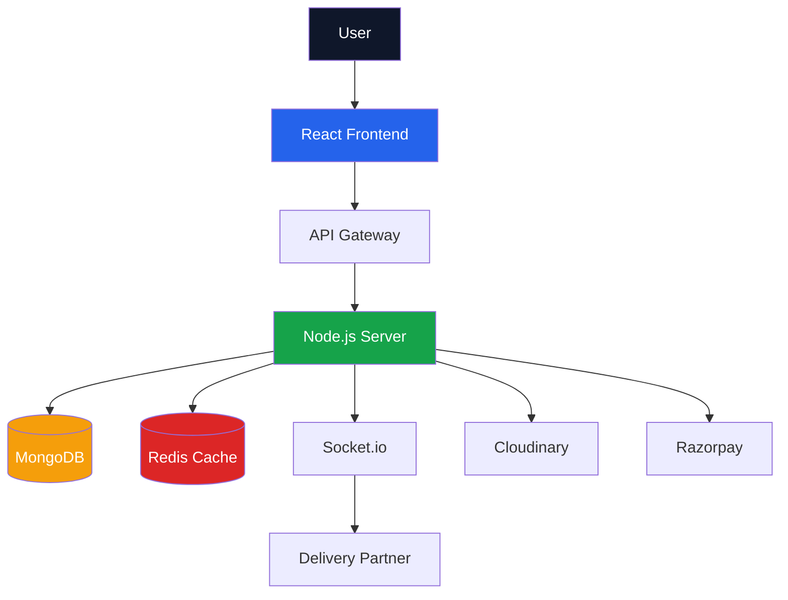
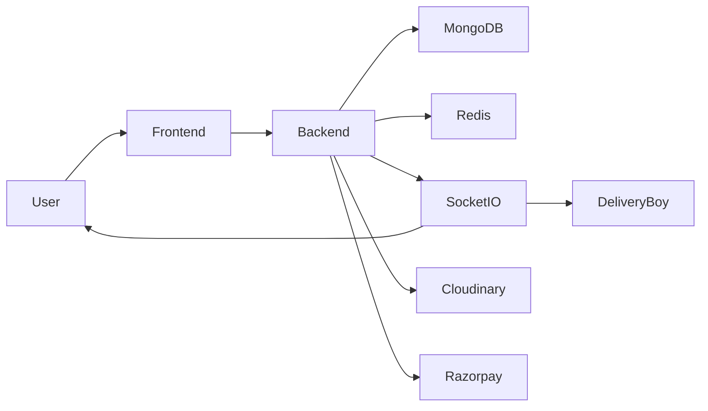

# Hi 👋, I'm Shiv Singh Baghel

🚀 Full Stack Developer | MERN Stack Developer | AI Enthusiast

- 🎓 B.Tech IT Student
- 💻 Solved 280+ DSA Problems
- 🌱 Learning System Design, Redis, AWS, Docker & AI Agents
- 🔭 Building Scalable Full Stack AI Applications
- ⚡ Interested in Backend Engineering & AI

## Tech Stack

JavaScript • TypeScript • React • Next.js • Node.js • Express.js • MongoDB • Redis • Docker • AWS • Socket.io

## Featured Projects

### 🍔 Foodify
Food Delivery Platform with Real-Time Tracking, Razorpay Payments, OTP Delivery Verification.

### 🚖 Rapido Clone
Vehicle Booking Platform with Live Tracking, Video KYC, Driver Dashboard.

### 🎥 YouTube Backend Clone
Scalable Backend Infrastructure with Authentication, Upload Pipeline, Redis Cache.

## GitHub Stats


<div align="center">

# 🚀 Foodify

### Modern Food Delivery Platform with Real-Time Tracking

<p align="center">
  
</p>

<p align="center">
  <a href="https://your-demo-link.com">
    
  </a>
  <a href="#">
    
  </a>
  <a href="#">
    
  </a>
</p>

</div>

---

## ✨ Overview

Foodify is a full-stack food delivery platform built with modern web technologies. Users can browse restaurants, place orders, track deliveries in real time, and make secure online payments.

### Key Features

- 🔐 Authentication & Authorization
- 📦 Order Management
- 🚚 Live Delivery Tracking
- ⚡ Real-Time Updates (Socket.io)
- 💳 Razorpay Payments
- ☁️ Cloudinary Image Upload
- 📱 Responsive UI
- 🔔 Instant Notifications

---

## 🖼️ Preview

| Home | Dashboard |
|-------|-----------|
|  |  |

---

## 🛠 Tech Stack

### Frontend

```txt
React.js
Tailwind CSS
Redux Toolkit
Axios
```

### Backend

```txt
Node.js
Express.js
MongoDB
Socket.io
```

### DevOps & Tools

```txt
GitHub Actions
Docker
Cloudinary
Render
```

---

## 📂 Project Structure

```bash
Foodify
│
├── client
│   ├── src
│   ├── components
│   ├── pages
│   ├── hooks
│   └── utils
│
├── server
│   ├── controllers
│   ├── routes
│   ├── middleware
│   ├── models
│   └── services
│
├── screenshots
├── public
└── README.md
```

---

## ⚙️ Environment Variables

```env
PORT=

MONGODB_URI=

JWT_SECRET=

CLOUDINARY_CLOUD_NAME=
CLOUDINARY_API_KEY=
CLOUDINARY_API_SECRET=

RAZORPAY_KEY_ID=
RAZORPAY_SECRET=
```

---

## 🚀 Getting Started

### Clone Repository

```bash
git clone https://github.com/username/foodify.git
cd foodify
```

### Install Dependencies

```bash
npm install
```

### Run Development Server

```bash
npm run dev
```

---

## 🌟 Core Features

### User

- Register & Login
- Browse Restaurants
- Place Orders
- Track Deliveries
- Online Payments

### Delivery Partner

- Accept Orders
- Live Location Sharing
- Delivery Verification

### Admin

- Manage Users
- Manage Orders
- Analytics Dashboard

---

## 🔒 Security

- JWT Authentication
- Password Hashing (bcrypt)
- Protected Routes
- Rate Limiting
- Input Validation

---

## 📊 System Design



---

## 📈 Architecture Graph



---

## 🤝 Contributing

```bash
Fork Repository
Create Feature Branch
Commit Changes
Push Branch
Create Pull Request
```

---

## 📜 License

MIT License

---

## 👨‍💻 Author

### Shiv Singh Baghel

- LinkedIn: https://www.linkedin.com/in/shivsinghbaghel/
- GitHub: https://github.com/shivsingh78

---

<div align="center">

⭐ Star this repository if you found it useful.

Built with ❤️ by Shiv Singh Baghel

</div>
